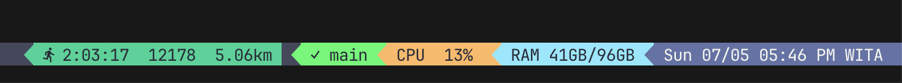
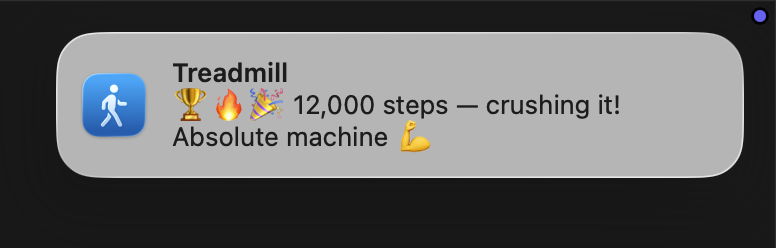
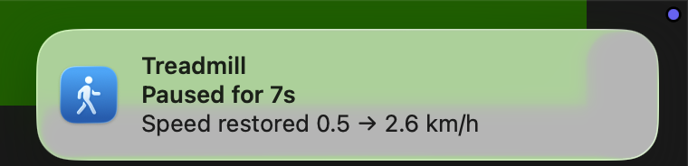
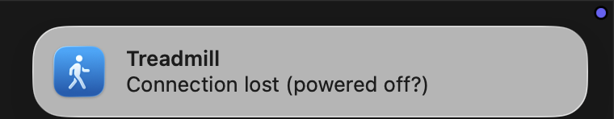
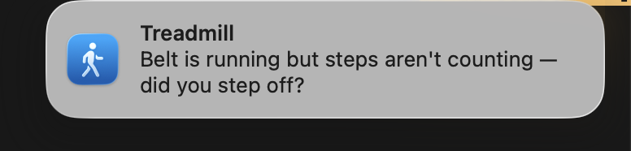
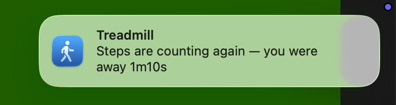
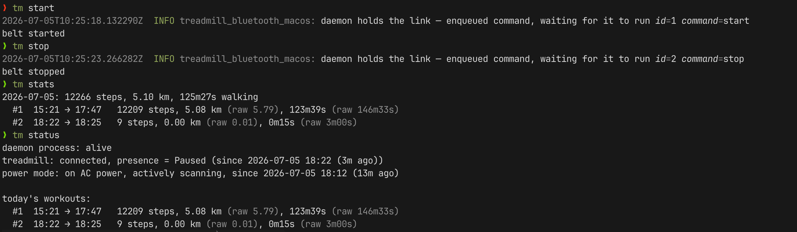
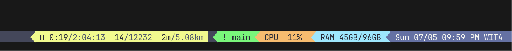

# 🏃 treadmill-bluetooth-macos

[](https://github.com/korniychuk/treadmill-bluetooth-macos/actions/workflows/ci.yml)
[](./LICENSE)
[](#-limitations)
[](https://www.rust-lang.org)

A **macOS** Bluetooth Low Energy connector for a **Yesoul** treadmill, written in **Rust** 🦀.

It discovers the treadmill over BLE (CoreBluetooth), connects, and streams live
telemetry — speed, distance, steps — over the standard **Fitness Machine Service**
(FTMS) GATT profile. A background daemon keeps the link alive, detects whether you
are actually walking (presence), splits your day into workouts, tracks step goals,
and can drive the treadmill (start / stop / target speed). 🏃💨

> ⚠️ **Unofficial.** Not affiliated with Yesoul. The BLE protocol was
> reverse-engineered against a single unit (Yesoul W2 Pro). It speaks generic
> FTMS, so other FTMS treadmills *may* work, but only the W2 Pro is verified.
> See [Limitations](#-limitations).

---

## ✨ Features

- 🔎 **Scan & connect** to the first FTMS treadmill nearby.
- 📈 **Live telemetry** — speed, distance, steps — streamed and logged.
- 🧠 **Presence detection** — belt moving but steps not rising ⇒ "away while
  running"; workouts are split on real activity, not wall-clock.
- 📊 **Daily stats** — steps / distance / walking-time, restart-safe.
- ❤️ **Heart rate** — pair a chest-strap BLE sensor (e.g. Polar H10) and get a
  compact `♥ avg/max` summary alongside your steps, plus a live bpm in the
  widget and a sensor-battery check (`tm status`, low-battery glyph in the
  widget). Optional — everything degrades silently when no sensor is worn.
- 🎯 **Step-goal milestones** — up to 3 daily goals with native macOS toasts.
- 🎛️ **Control** — start / stop / set target speed on a live link.
- 🖥️ **tmux status-bar widget** — see the current workout in your status line
  (see [`scripts/tmux/`](./scripts/tmux)).
- 🛟 **Self-healing daemon** — auto reconnect, watchdog, pause/resume speed
  restore, AC-power awareness (won't drain the battery when idle).

## 📸 Demo

**Live workout in your tmux status bar** (walking = green, paused = yellow):



**Native macOS toasts** for milestones, presence and connection state:

<table>
  <tr>
    <td></td>
    <td></td>
  </tr>
  <tr>
    <td></td>
    <td></td>
  </tr>
  <tr>
    <td></td>
    <td></td>
  </tr>
</table>

**CLI** — control the belt, then read stats & status:



## 📋 Requirements

- 🍎 **macOS** (Apple Silicon or Intel). No Linux / Windows — see [Limitations](#-limitations).
- 📡 Bluetooth, and a treadmill exposing FTMS (`0x1826`).
- 🦀 To build from source: **Rust 1.95+** (edition 2024). `rustup` recommended.
- 🎨 To regenerate the app icon only: Xcode Command Line Tools (`swift`).

## 🚀 Quickstart (from source)

```bash
git clone https://github.com/korniychuk/treadmill-bluetooth-macos.git
cd treadmill-bluetooth-macos

cargo run                 # scan: list nearby BLE devices (diagnostic)
cargo run -- connect      # connect to the first FTMS treadmill and stream data
```

On first run macOS asks for **Bluetooth permission** — grant it, otherwise the
scan returns nothing. (The permission is attributed to a stable app identity via
an embedded `Info.plist`; see [`docs/tasks/002`](./docs/tasks/002-macos-bluetooth-permission.md).)

Verbose logs:

```bash
RUST_LOG=debug cargo run -- connect
```

## 🎛️ Install the background daemon

The daemon auto-connects, tracks presence and stats, shows toasts, and owns the
BLE link so CLI control commands can be routed to it.

```bash
scripts/install-daemon.sh      # build, code-sign, install LaunchAgent, symlink `tm`
scripts/uninstall-daemon.sh    # remove the LaunchAgent (keeps your data)
```

`install-daemon.sh` builds a release binary, code-signs it, registers a
notification identity, writes a **LaunchAgent** (`~/Library/LaunchAgents/…`,
auto-starts at login), and symlinks a short `tm` alias into `~/.bin` so you can
run `tm stats` / `tm status` from anywhere. Add `~/.bin` to your `PATH` if it
isn't already.

> 🔁 **Re-run `install-daemon.sh` after every rebuild** — it re-signs and reloads
> the LaunchAgent. A bare `cargo build` leaves the daemon pointing at a stale or
> differently-signed binary.

### 🕹️ Commands

```bash
tm                    # = scan: list nearby BLE devices
tm connect            # connect and stream (foreground)
tm daemon             # run the background loop (normally launched by launchd)
tm stats              # today's stats;  tm stats --all  → every day
tm status             # daemon / connection / presence snapshot
tm widget             # compact TSV of the current workout (for status bars)
tm hr                 # diagnostic: connect to a heart-rate sensor, print battery + live bpm
tm speed <kmh>        # set target speed on the live link
tm start | tm stop    # start / stop the belt
tm recompute-segments # rebuild workout segments from raw samples (no BLE)
tm default-speed      # show the computed default start speed (no BLE)
tm --help             # full command list
```

## ⬇️ Install a prebuilt binary (no Rust needed)

Each tagged release ships an **unsigned, ad-hoc** macOS binary (Apple Silicon)
as a `.tar.gz` on the
[Releases](https://github.com/korniychuk/treadmill-bluetooth-macos/releases) page.
One-liner — grab the latest and install it as a daemon:

```bash
curl -fsSL https://github.com/korniychuk/treadmill-bluetooth-macos/releases/latest/download/treadmill-bluetooth-macos-macos-arm64.tar.gz | tar -xz
cd treadmill-bluetooth-macos-macos-arm64
./scripts/install-prebuilt.sh
```

`install-prebuilt.sh` strips the quarantine attribute, ad-hoc-signs the binary,
installs it to a stable location, registers the notification identity, and loads
the LaunchAgent — **no cargo, no toolchain**. To sign with your own certificate
for a rebuild-stable Bluetooth grant, pass `IDENTITY="<cert name>"`.

> 🍏 **Apple Silicon only** for prebuilt binaries (CI builds `arm64`). On Intel,
> build from source (see [Quickstart](#-quickstart-from-source)).

Prefer to just run it by hand instead of installing the daemon:

```bash
xattr -d com.apple.quarantine ./treadmill-bluetooth-macos
./treadmill-bluetooth-macos connect
```

## ⚙️ Configuration

Per-user config (TOML) lives **outside this repo**, at:

```
~/.config/treadmill-bluetooth-macos/config.toml
```

Copy [`config/config.example.toml`](./config/config.example.toml) there and edit it
(every key is optional; the example documents each default as a commented line):

```toml
goals = [8000, 10000, 12000]
# workout_gap_minutes = 15
# auto_pause_minutes = 5
```

- 🎯 `goals` — up to 3 thresholds; each is celebrated once per day with a toast.
- ⏱️ `workout_gap_minutes` (optional, default 15) — segments closer than this merge
  into one displayed workout. Applied **at read time**, so changing it is
  retroactive; no recompute needed.
- ⏸️ `auto_pause_minutes` (optional, default 5, `0` = off) — how long the belt may
  keep running while nobody is walking (you stepped off) before the daemon pauses
  it; the machine's own shutoff then powers it down.

Edits are **hot-reloaded** by the daemon within ~5s while it is connected to the
treadmill (see [`docs/tasks/017`](./docs/tasks/017-hot-reload-goals-config.md)).
A missing file is fine (built-in defaults `[8000, 10000, 12000]`); a malformed
file logs a WARN and falls back to defaults. Override the path with the
`TREADMILL_CONFIG` env var. `tm status` shows the config the daemon currently
has loaded and when it last read it.

## 🖥️ tmux status-bar widget

`tm widget` prints a compact, tab-separated line for a status bar (empty output
when the treadmill is off, so the segment hides). A reference renderer for
**Dracula** (and a plain-tmux variant) lives in
[`scripts/tmux/`](./scripts/tmux) — see its README for the install recipe and
the exact output contract.



## ⚠️ Limitations

- 🍎 **macOS only.** The permission flow, notifications, code-signing, LaunchAgent
  and IOKit/CoreFoundation glue are all macOS-specific. No Linux / Windows.
- 🧪 **Verified on one device** — Yesoul W2 Pro (`FW SDC_W2_BT_V3.03-50-54`). Written
  as generic FTMS, so other FTMS treadmills may work, but are untested.
- ⛰️ **No incline.** The W2 Pro does not expose inclination over FTMS
  (`SetTargetInclination` → *Operation Failed*, no `0x2AD5`). Incline is remote-only.
- 🎚️ **Partial control.** Start / stop and target-speed are implemented and
  hardware-verified. Incline is not. LED backlight control is
  [backlog](./docs/backlog/004-led-control-via-hci-capture.md), not started.
- 🔕 **Not in the macOS Bluetooth menu — by design.** The treadmill is app-managed
  BLE, without OS-level pairing/bonding (avoids a race for the single BLE central
  with the phone app). See [ADR 0001](./docs/adr/0001-no-macos-bluetooth-device-list.md).
  Status is via `tm status` / the widget, not System Settings.
- 🔏 **Code signing.** Without your own signing identity, macOS re-prompts for
  Bluetooth on every rebuild (ad-hoc signatures change the cdhash). Release
  binaries are **not notarized** — Gatekeeper will warn unless you strip
  quarantine or build locally.

## 🧑‍💻 Development

```bash
cargo test     # unit tests
cargo clippy   # lints
cargo fmt      # format
```

CI (GitHub Actions, `macos-latest`) runs fmt / clippy / build / test on every
push and PR. See [`CONTRIBUTING.md`](./CONTRIBUTING.md).

Architecture and protocol notes live in [`CLAUDE.md`](./CLAUDE.md); research,
decisions (ADRs) and the task journal live in [`docs/`](./docs).

## 📄 License

MIT — see [`LICENSE`](./LICENSE).
